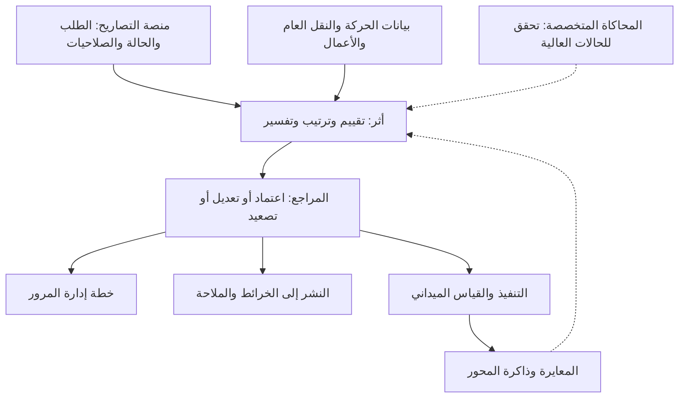

# المقارنات المرجعية الشاملة لمشروع أثر

تاريخ الرصد: ٢٣ يوليو ٢٠٢٦

حالة الأدلة: مصادر رسمية عامة، ووثائق منتجات، وأدلة حكومية، ووثائق المشروع المحلية.

نطاق الجرد:

- اثنتان وأربعون ميزة في أثر.

- ثلاث وأربعون منصة ومنتجًا ومعيارًا مرجعيًا.

- واحد وستون رابط إثبات رسمي.

- ثمان وعشرون ميزة تعمل في الرحلة الرئيسية.

- ست ميزات تعمل في المختبر.

- ثماني ميزات مخططة أو مشروطة بالتكامل.

حالة التحقق:

- جميع ملفات التقرير الستة موجودة وروابطها الداخلية سليمة.

- لكل ميزة قسم مستقل يذكر أقرب المنافسين.

- لكل منافس قسم مستقل يذكر قدراته المثبتة وحدوده وعلاقته بأثر.

- استجابت تسعة وخمسون صفحة رسمية للفحص الآلي.

- تعذر الفحص الآلي لمصدرين بسبب اتصال الموقع، وتم التحقق من ظهورهما ومحتواهما عبر محرك البحث.

## النتيجة الجامعة

المشروع لا يعمل في سوق خالٍ من المنافسة.

كل قطعة تقريبًا من الحل لها سابقة ناضجة في منتج أو منصة أو أداة متخصصة.

التميّز الممكن ليس في الخريطة، أو التصريح، أو التنبؤ، أو المحاكاة، أو الذكاء الاصطناعي منفردًا.

التميّز الممكن هو جمع هذه القدرات حول قرار تصريح الحفر السعودي، مع تفسير القرار وقياس دقته بعد التنفيذ.

## أخطر خمسة مراجع

### المرجع الأول

`Balady Nasq`

هو المنافس المحلي الحاكم.

يغطي مسار التصاريح، وإدارة دورة حياة العمل، والخرائط التفاعلية، والتعارضات الزمانية والمكانية، وتنسيق الحفريات المتعددة، والصلاحيات، والمتابعة، والمخالفات.

لا يجوز تقديم أثر بوصفه بديلًا عنه.

التموضع الصحيح هو طبقة تحليل قرار تندمج معه.

### المرجع الثاني

`Causeway one.network`

هو أقوى منصة تشغيلية مباشرة.

يجمع بيانات أعمال الطرق، والتنسيق، والتحويلات، والخريطة العامة، والتحديث الميداني، والنشر إلى تطبيقات الملاحة.

يجب على أثر أن يضاهي سهولة النشر والتكامل، ثم يتميز بدرجة الأثر السعودية وترتيب البدائل وذاكرة المعايرة.

### المرجع الثالث

`LTA PROMPT`

`AI Road Works Planner`

هو أخطر مرجع على ادعاء الأتمتة.

يولد خطط التحكم المروري، ويفحص المستندات، ويقدم توصيات للطلبات البسيطة.

لا يجوز تقديم توليد الخطة أو مراجعة الطلب بالذكاء الاصطناعي بوصفهما ابتكارًا غير مسبوق.

### المرجع الرابع

`FHWA QuickZone`

`FHWA WISE`

هما أخطر مرجعين على قلب الفكرة التحليلي.

الأول يقدّر التأخير والطوابير وتكلفة مستخدم الطريق ويقارن العمل الليلي بالنهاري ومراحل التنفيذ والتحويلات.

الثاني يحلل عدة مناطق عمل متزامنة على شبكة، ويقارن البدائل، ويقترح تسلسلًا أكثر كفاءة.

### المرجع الخامس

`Aimsun Live`

هو أعلى سقف للتنبؤ والتوأم الرقمي وذاكرة المعايرة.

يتنبأ بالشبكة، ويرتب خطط الاستجابة حسب مؤشرات الأداء، ويقارن التوقعات بالقياس الميداني لتحسين الدقة.

## ما يملكه أثر فعلًا

يعمل الآن في النموذج الرئيسي:

- تحديد موقع الحفر ومدخلات الإغلاق.

- محاكاة زمنية على مدار اليوم.

- درجة أثر مروري منسوبة إلى الإغلاق.

- مقارنة مع حالة مقابلة بلا إغلاق.

- ثلاثة مسارات بديلة محسوبة.

- تنبؤ زمني بنطاق عدم يقين.

- معايرة من ملف بيانات.

- ترتيب بدائل الجدولة.

- تفسير أسباب فوز البديل.

- تقدير قيمة الوقت.

- تقدير الوقود والانبعاثات.

- تقدير أثر النقل العام.

- كشف المرور قرب مستشفى أو مدرسة.

- كشف أثر تصريح مجاور.

- تقدير قيمة الحفر المشترك.

- إنشاء مسودة عربية لخطة إدارة المرور.

- سجل افتراضات ومصادر.

- تشغيل مستقل أو عبر خدمة محلية.

يعمل في مختبر الابتكار:

- حد تأثير مكاني يتغير مع الطلب والسعة.

- ميزانية أثر شهرية للمحور.

- مساهمات رقمية تفسر ترتيب البدائل.

- مصفوفة تعارض لمحفظة التصاريح.

- تجميع فرص الحفر المشترك.

- ذاكرة تقارن المتوقع بالمرصود وتنتج معامل تصحيح.

مخطط له أو مشروط بالتكامل:

- الربط المباشر مع منصة التصاريح.

- محاكاة متخصصة للحالات عالية الأثر.

- نشر الإغلاقات إلى تطبيقات الملاحة.

- حماية مسارات الطوارئ.

- مراعاة المواسم والمدارس وأوقات الصلاة.

- تحليل وصول المشاة وذوي الإعاقة.

- إشعارات عبر القنوات الوطنية.

- مراقبة حية من حساسات وأجهزة مناطق العمل.

## الخريطة التنافسية المختصرة

### التصاريح والتنسيق

- `Balady Nasq`
- `Causeway one.network`
- `Street Manager`
- `LondonWorks`
- `Symology Aurora`
- `WDM Street Works`
- `GEOworks`
- `myWorksites`
- `OpenGov`
- `Trimble Cityworks`
- `LTA PROMPT`
- `Dubai ROWPS`
- `QPRO`

### التأخير والتكلفة والجدولة

- `QuickZone`
- `WISE`
- `RealCost`
- `Aimsun Live`
- `Aimsun Next`
- `PTV Vissim`
- `SUMO`

### المسارات وبيانات الحركة

- `Google Routes API`
- `TomTom Traffic`
- `HERE Traffic`
- `INRIX`
- `StreetLight InSight`

### خطط إدارة المرور

- `AI Road Works Planner`
- `Road Manager`
- `RapidPlan`

### الخريطة العامة والنشر والتنبيه

- `Esri Road Closures`
- `Waze for Cities`
- `WZDx`
- `HAAS Alert Safety Cloud`
- `Ver-Mac JamLogic`

### الوصول الحرج والنقل العام

- `Econolite Centracs Priority`
- `LYT.emergency`
- `Remix`
- `Conveyal`
- `ArcGIS Network Analyst`
- `GTFS`

### الحفر المشترك والأصول المدفونة

- `London Infrastructure Mapping Application`
- `NUAR`
- `Symology Aurora`
- `Causeway one.network`

## معمار تجربة أثر المقترح

## ملفات التقرير

[جرد ميزات أثر وحالة كل ميزة](athar-feature-inventory.md)

[خريطة كل ميزة إلى منافسيها](feature-to-competitors.md)

[كتالوج المنافسين وقدرات كل منافس](competitor-catalog.md)

[خرائط تجربة المستخدم والرحلات](user-experience-uml.md)

[القرارات الاستراتيجية وما يجب نسخه أو دمجه أو رفضه](strategic-decisions.md)

[سجل المصادر الرسمية](sources.md)

## حدود البحث

يشمل الكتالوج كل منتج أو منصة ظهر لها ارتباط جوهري بميزة موجودة أو مخطط لها في أثر، وكان لها دليل رسمي عام يمكن التحقق منه.

لا تعني عبارة «غير مثبت» أن القدرة غير موجودة داخل نظام مغلق.

تعني فقط أن القدرة لم تظهر في المصدر العام الذي تمت مراجعته.

لم يتم الدخول إلى حسابات تجارية مغلقة، ولم تُنشأ تصاريح فعلية، ولم تُشتر تراخيص للمنتجات.

لذلك لم تُختلق تفاصيل الشاشات الداخلية أو الأسعار أو التكاملات غير المنشورة.
