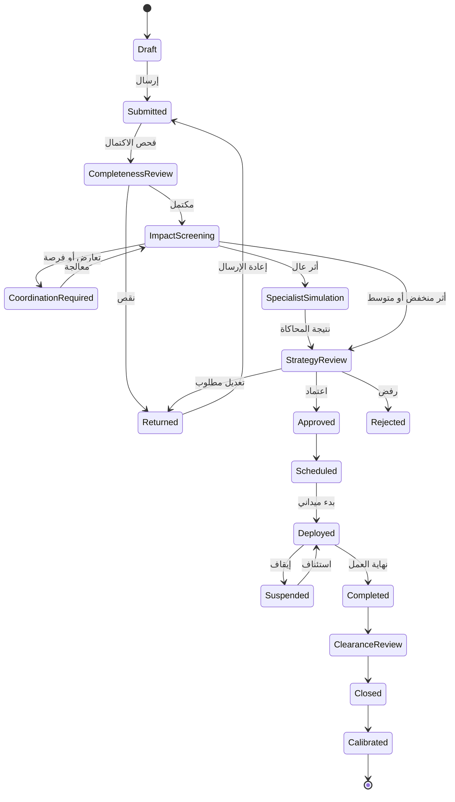
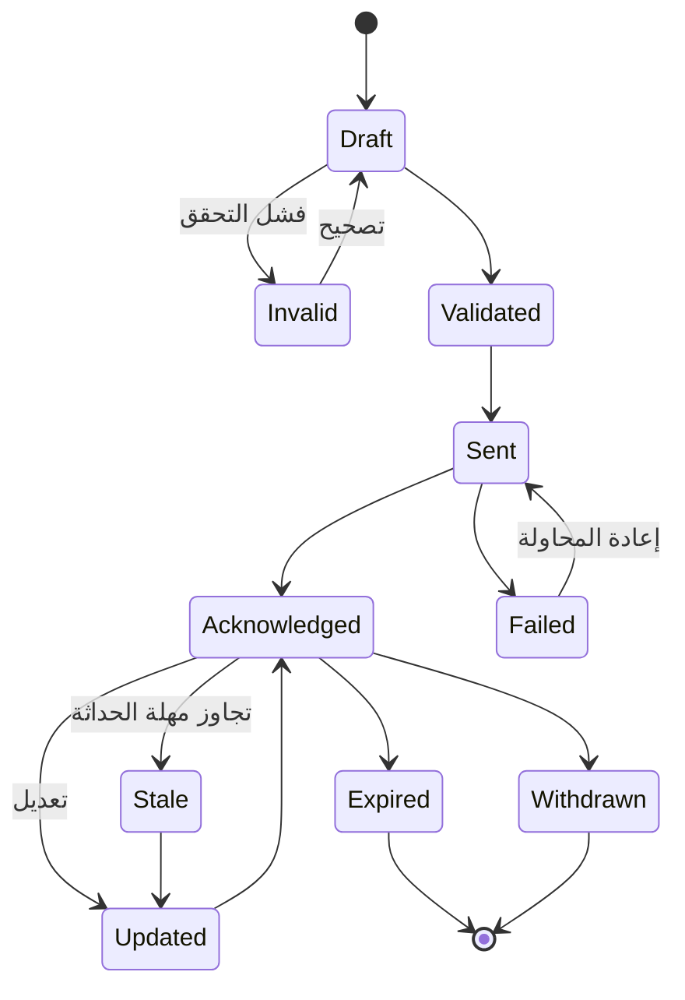
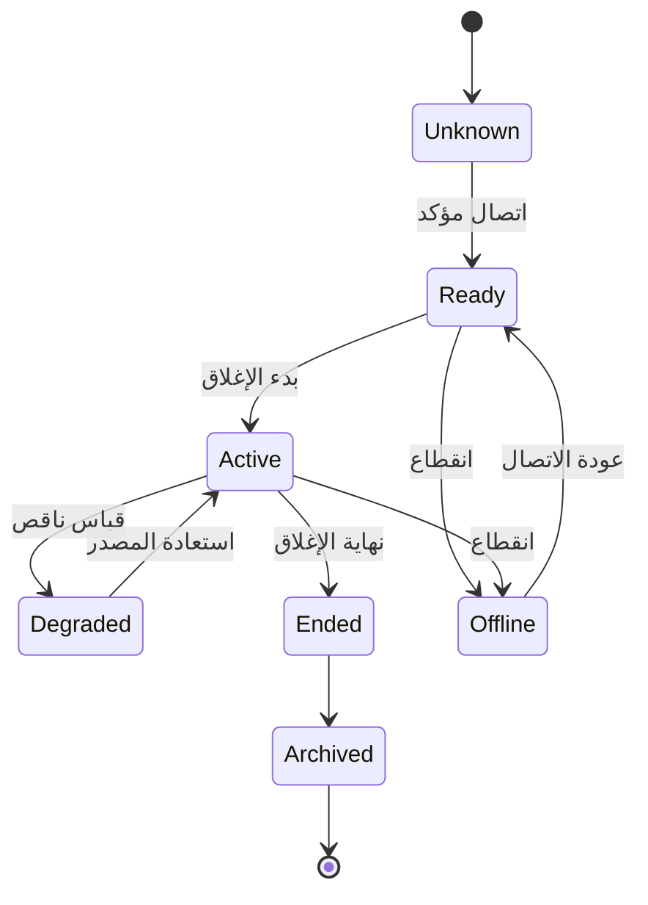

# نماذج البيانات وآلات الحالات

## الهدف

منع بناء الواجهة بوصفها بطاقات منفصلة لا تشترك في حالة واحدة.

كل شاشة يجب أن تقرأ من سجل عمل موحد وقابل للتدقيق.

## الكيانات الأساسية

### سجل العمل

`WorkPermit`

الحقول الأساسية:

- المعرف الداخلي.
- معرف المنصة الوطنية.
- المرجع الذي أدخله المستخدم.
- نوع الطلب.
- الجهة المالكة.
- المقاول.
- نوع الطريق وحساسيته.
- الحالة.
- وقت الإنشاء والتحديث.
- رقم النسخة.

### الهندسة المكانية

`WorkGeometry`

الحقول:

- نوع الهندسة.
- أجزاء متعددة.
- اتجاه الطريق.
- المسارات المتأثرة.
- نقاط البدء والنهاية.
- مرجع شبكة الطريق.
- نظام الإحداثيات.
- مصدر الهندسة.
- جودة المطابقة.

### خطة الإغلاق

`ClosurePlan`

الحقول:

- نوع الإغلاق.
- عدد المسارات المغلقة.
- عدد المسارات المتبقية.
- وقت البدء والنهاية.
- مراحل التنفيذ.
- التحويلة.
- نقاط التحكم.
- وصول المشاة.
- وصول الطوارئ.
- حالة النشر.

### حالة الأساس

`TrafficBaseline`

الحقول:

- فترة المرجع.
- السرعة الحرة.
- الطلب حسب الساعة.
- السعة.
- بيانات النقل العام.
- مصدر القياس.
- تاريخ الحداثة.
- نسخة المعايرة.

### السيناريو

`ImpactScenario`

الحقول:

- نوع السيناريو.
- خطة الإغلاق.
- وقت التشغيل.
- الطلب المستخدم.
- زمن الرحلة.
- ساعات المركبات.
- ساعات الأشخاص.
- الطابور.
- الوقود.
- الانبعاثات.
- المرافق المتأثرة.
- مستوى الثقة.
- الأسباب.

### التوصية

`Recommendation`

الحقول:

- ترتيب البديل.
- القرار المقترح.
- الفرق عن الطلب.
- المؤشرات الفائزة.
- المساهمات الرقمية.
- القيود المكسورة.
- مستوى الثقة.
- الشخص الذي اعتمد.
- وقت الاعتماد.

### التعارض

`Conflict`

الحقول:

- العملان المتعارضان.
- نوع التداخل.
- المساحة المشتركة.
- النافذة الزمنية المشتركة.
- أثر الشبكة.
- درجة الخطورة.
- حالة المعالجة.
- قرار المنسق.

### مجموعة التعاون

`CoordinationGroup`

الحقول:

- الأعمال الأعضاء.
- الجهة المنسقة.
- نافذة التعاون.
- الهندسة المشتركة.
- وفر التنفيذ.
- وفر أثر الناس.
- توزيع الوفر.
- قرار كل جهة.

### خطة إدارة المرور

`TrafficManagementPlan`

الحقول:

- رقم النسخة.
- عناصر الرسم.
- مكتبة العلامات المستخدمة.
- مراحل التنفيذ.
- المرفقات.
- حالة المراجعة.
- نتيجة التحقق.
- رابط الطباعة.

### النشر

`Publication`

الحقول:

- القناة.
- الصيغة.
- رقم النسخة.
- وقت الإرسال.
- وقت الإقرار.
- آخر تحديث.
- وقت الانتهاء.
- الحالة.
- رسالة الخطأ.

### الملاحظة الميدانية

`FieldObservation`

الحقول:

- وقت القياس.
- الموقع.
- حالة الإغلاق.
- السرعة.
- طول الطابور.
- زمن الانتظار.
- صورة أو مرفق.
- الجهاز أو المستخدم.
- جودة المصدر.

### تشغيل المعايرة

`CalibrationRun`

الحقول:

- نسخة التوقع.
- نافذة الأساس.
- نافذة التنفيذ.
- المؤشرات المرصودة.
- الخطأ.
- معامل التصحيح.
- قرار قبول المعايرة.
- وقت التشغيل.

### حدث التدقيق

`AuditEvent`

الحقول:

- الكيان.
- رقم النسخة.
- الفعل.
- الحالة السابقة.
- الحالة التالية.
- المستخدم أو النظام.
- السبب.
- الوقت.
- المرفق.

## آلة حالة العمل



## آلة حالة النشر



## آلة حالة القياس الميداني



## قواعد لا تقبل الكسر

1. لا تعتمد توصية بلا نسخة مدخلات.
2. لا ينشر إغلاق بلا اتجاه وزمن انتهاء.
3. لا تعدل نتيجة منشورة من دون إنشاء نسخة جديدة.
4. لا تحول قياسًا ضعيف الجودة إلى معايرة تلقائية.
5. لا يختفي حدث من سجل التدقيق.
6. لا يجمع وفر التنفيذ ووفر وقت السكان في رقم واحد.
7. لا يتحول تنبيه مرفق حرج إلى رفض آلي بلا قاعدة معتمدة.
8. لا تستخدم حالة لونية بلا نص ورمز.

## الحد الأدنى لواجهة التكامل

### إدخال

```json
{
  "permitReference": "string",
  "geometry": {
    "type": "MultiLineString",
    "coordinates": []
  },
  "closure": {
    "start": "date-time",
    "end": "date-time",
    "closedLanes": 1,
    "remainingLanes": 2
  },
  "road": {
    "networkId": "string",
    "sensitivity": "normal"
  }
}
```

### إخراج القرار

```json
{
  "decisionVersion": "string",
  "impactLevel": "low",
  "confidence": "medium",
  "recommendedScenarioId": "string",
  "reasons": [],
  "constraints": [],
  "publicationReady": false
}
```

## مبدأ النسخ

رقم التصريح ثابت.

الهندسة والخطة والتحليل والقرار والنشر لكل منها رقم نسخة مستقل.

بهذا يمكن تفسير أي نتيجة تاريخية حتى بعد تغير البيانات أو النموذج.
