# خرائط تجربة المستخدم والرحلات

## طريقة القراءة

المخططات التالية تفصل بين ثلاثة مستويات:

- الرحلة الموجودة فعلًا في النموذج التفاعلي.

- الرحلة المستهدفة بعد التكامل مع أنظمة التصاريح والبيانات الحية.

- الرحلات المرجعية لأهم المنافسين.

المرجع المرئي المرسل يستخدم مخطط تدفق نشاط أكثر من كونه مخططًا رسميًا صارمًا.

اتبعت هنا الأسلوب نفسه، ثم أضفت مخطط أطراف ومخطط تسلسل حتى تصبح التجربة قابلة للتنفيذ.

## الخريطة الجامعة

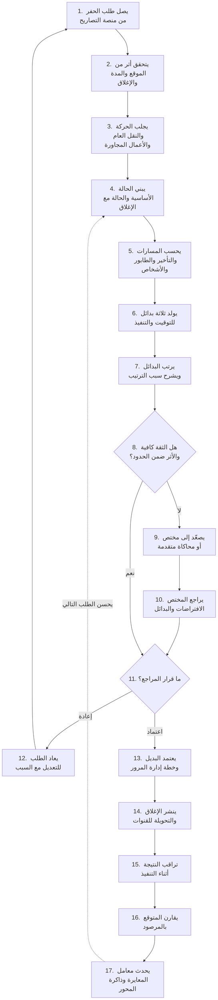

## رحلة النموذج التفاعلي الحالية

هذه الرحلة مثبتة في الواجهة الحالية.

التكامل الخارجي والنشر الوطني ليسا جزءًا منها بعد.

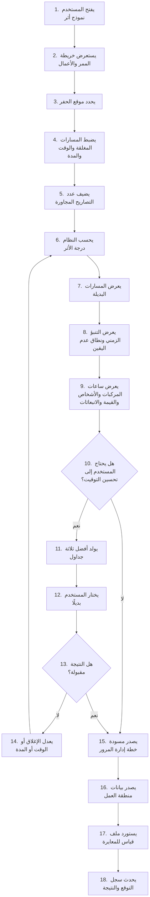

## مخطط الأطراف وحالات الاستخدام

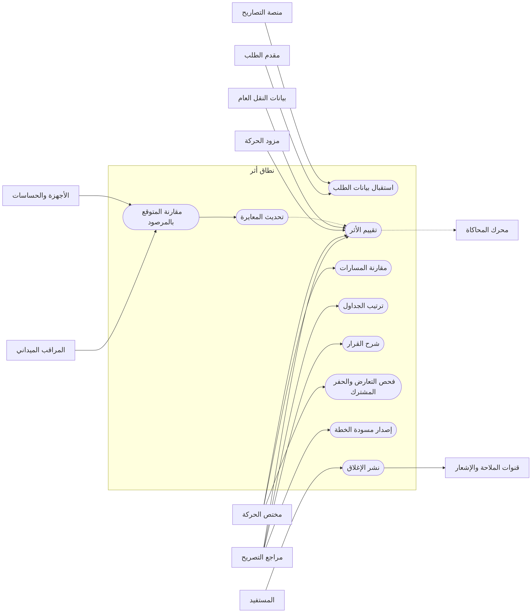

## مخطط التسلسل التشغيلي المستهدف

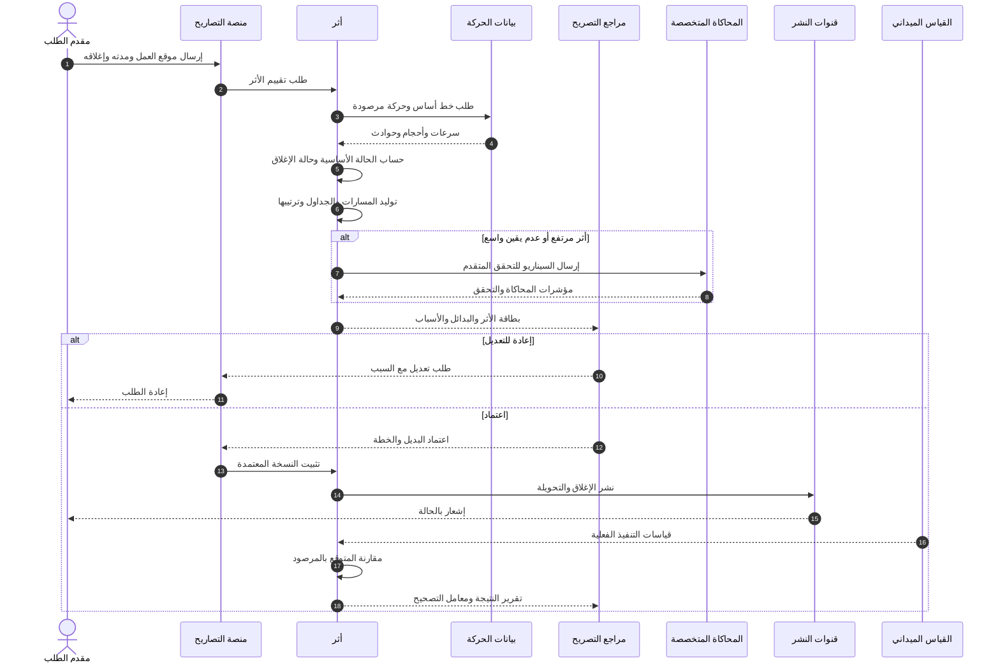

## رحلة المراجع داخل شاشة القرار

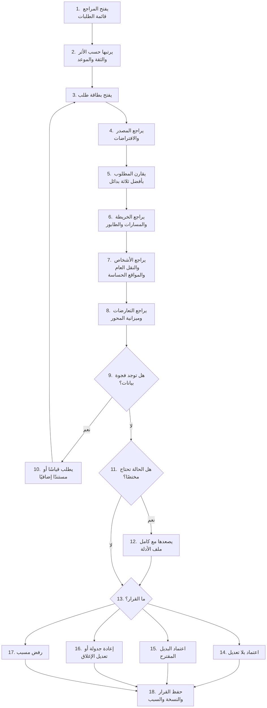

## رحلة المنافس المحلي

`Balady Nasq`

هذه الرحلة مبنية على الخدمات والحالات المنشورة علنًا.

لا تُنسب إليها شاشة تنبؤ مروري غير ظاهرة في المصدر العام.

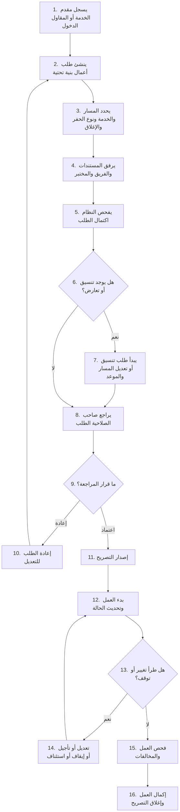

## رحلة أقوى منافس تشغيلي

`Causeway one.network`

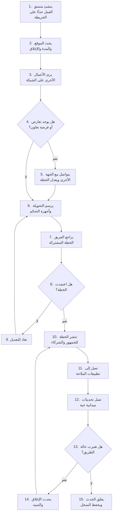

## رحلة الأتمتة الحكومية

`LTA PROMPT`

`Road Works Planner`

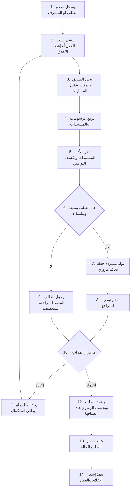

## رحلة التحليل السريع والمحفظة

`FHWA QuickZone`

`FHWA WISE`

هذه رحلة محلل وليست رحلة مواطن أو مقدم تصريح.

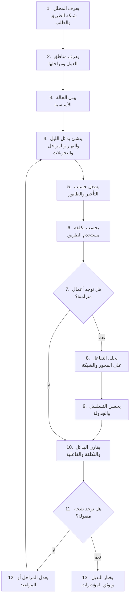

## رحلة التوأم الرقمي والمعايرة

`Aimsun Live`

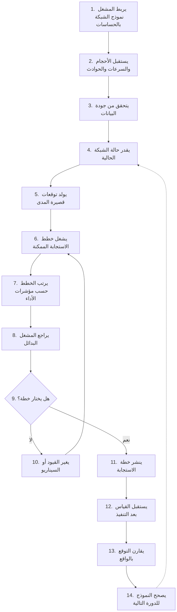

## رحلة النشر إلى السائق

هذه الرحلة تجمع دور معايير البيانات ومنصات الخرائط والتنبيه.

لا تعني أنها منتج واحد.

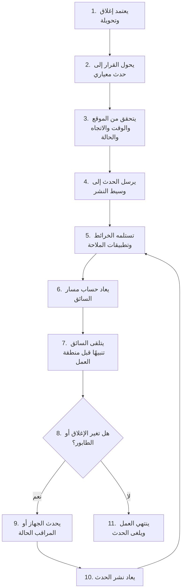

## رحلة الحفر المشترك

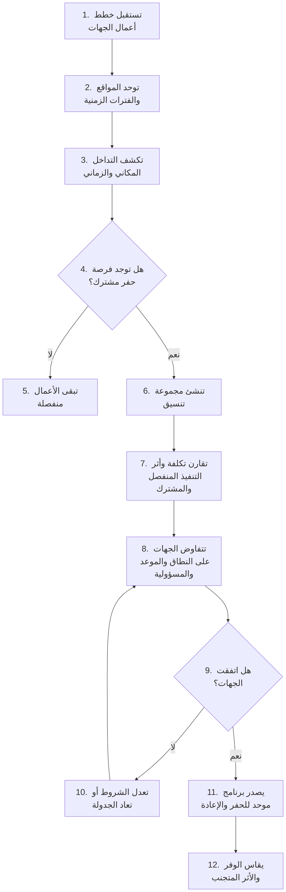

## تغطية المنافسين بهذه الرحلات

رحلة التصاريح والتنسيق تغطي وظيفيًا:

- منصة بلدي.

- المنصة الوطنية البريطانية.

- منصات أعمال الشوارع التجارية.

- منصات تصاريح حرم الطريق.

- المنصات الخليجية.

رحلة التحليل والمحفظة تغطي وظيفيًا:

- أدوات التأخير والطوابير والتكلفة.

- أدوات المحاكاة المجهرية.

- أدوات التوأم الرقمي.

رحلة النشر تغطي وظيفيًا:

- معيار بيانات منطقة العمل.

- منصات الخرائط العامة.

- تطبيقات الملاحة.

- منصات التنبيه داخل المركبة.

- أجهزة منطقة العمل.

رحلة الحفر المشترك تغطي وظيفيًا:

- منصات تنسيق الاستثمار.

- خرائط الأصول المدفونة.

- كشف تعارض أعمال الجهات.

## الفجوة التي يجب أن توضحها تجربة أثر

أغلب المنصات تبدأ من إنشاء العمل وتنتهي عند إصدار التصريح أو نشر الإغلاق.

أغلب أدوات التحليل تبدأ من نموذج شبكة وتنتهي عند مؤشرات فنية.

أثر يجب أن يوصل الرحلتين:

- يبدأ من طلب تصريح حقيقي.

- يحول البيانات إلى بدائل مفهومة للمراجع.

- يعيد القرار إلى منصة التصاريح.

- ينشر النتيجة المعتمدة.

- يقيس التنفيذ.

- يتعلم من الخطأ.
