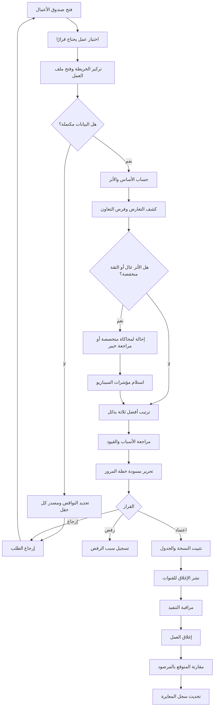
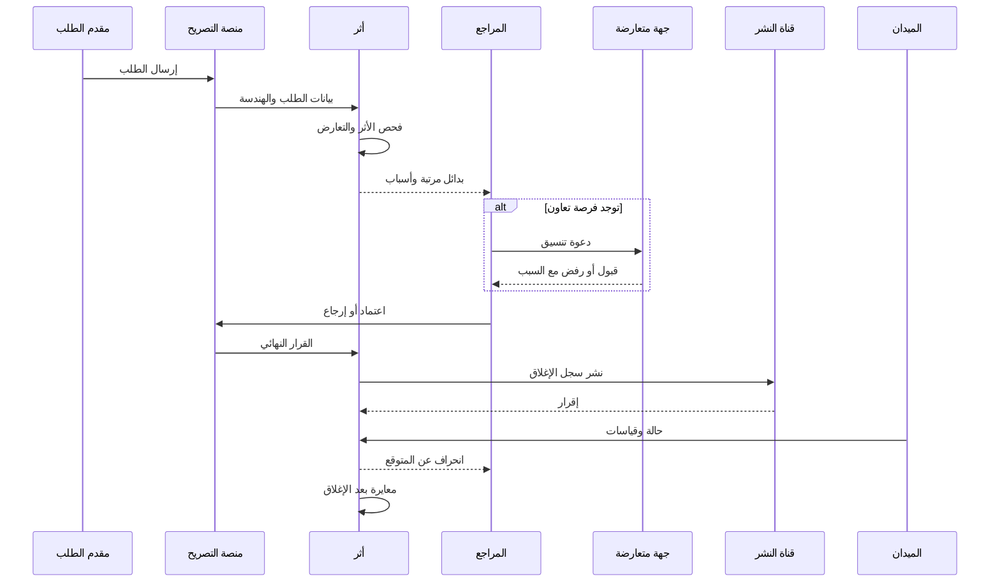
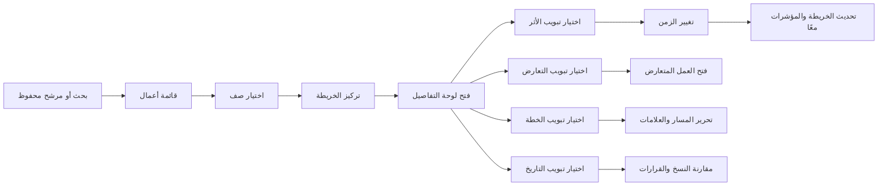
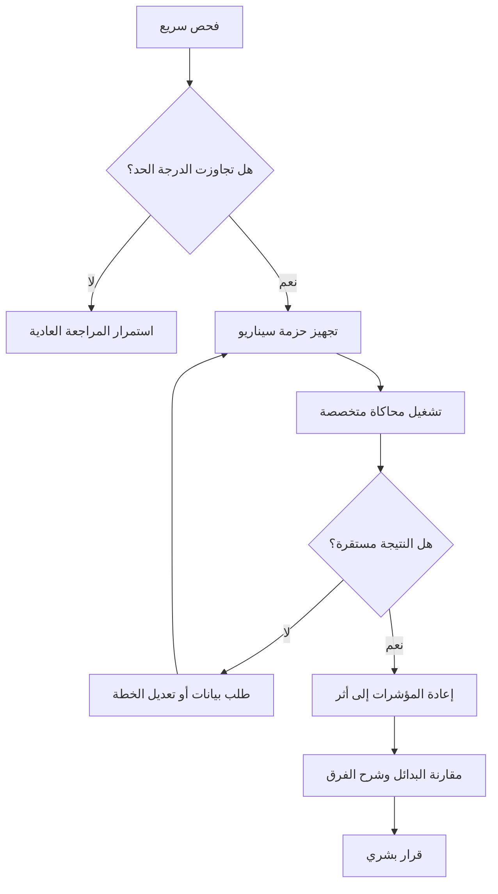
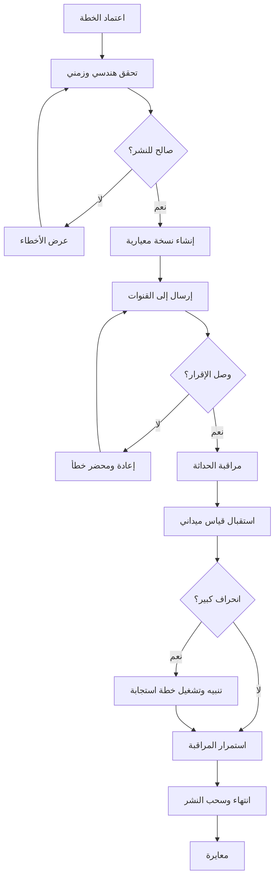

# خرائط تجربة المستخدم

## رحلة المراجع الكاملة

## الرحلة بين الجهات

## رحلة شاشة الخريطة

## رحلة الحالة عالية الأثر

## رحلة النشر والقياس

## شاشات المنتج

### سطح العمل

- صندوق الأعمال.
- خريطة القرار.
- ملف العمل.
- لوحة المؤشرات.

### العمل

- ملخص الطلب.
- البيانات الناقصة.
- الأثر.
- البدائل.
- التعارضات.
- فرصة التعاون.
- خطة المرور.
- سجل القرار.
- حالة النشر.
- القياس الفعلي.

### الإدارة

- قواعد التصعيد.
- قاموس الحالات.
- مصادر البيانات.
- نسخ النموذج.
- الجهات والصلاحيات.
- إعدادات النشر.

### الميدان

- مهام اليوم.
- خريطة الموقع.
- بدء وإيقاف.
- قياس الطابور والسرعة.
- صورة وملاحظة.
- إنهاء المهمة.

### الجمهور

- بحث باسم الطريق.
- الأعمال الحالية والقادمة.
- وصف مبسط.
- الجهة والمقاول.
- وقت البدء المتوقع والنهاية.
- التحويلة المعتمدة.
- وقت آخر تحديث.

## حالات الشاشة الإلزامية

لكل شاشة:

- تحميل أولي.
- لا توجد نتائج.
- بيانات قديمة.
- اتصال منقطع.
- صلاحية غير كافية.
- فشل مصدر واحد مع بقاء البقية.
- تعديل غير محفوظ.
- تعارض بين نسختين.
- إجراء ناجح.
- إجراء يحتاج متابعة.
